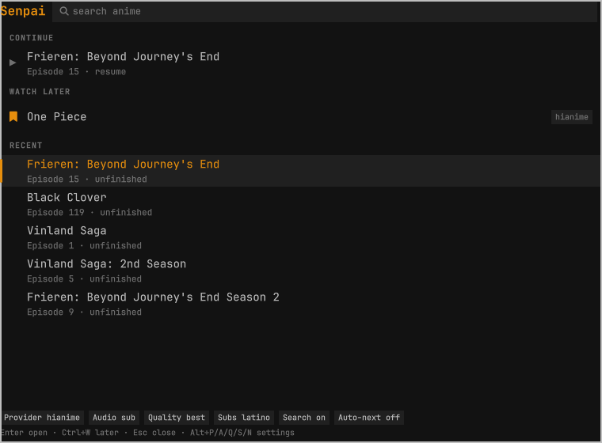

# Senpai

Anime from the Omarchy bar: search, pick up where you left off, keep a
watch-later list, watch in mpv. ani-py with Latin American subtitles.



A bar widget shows what is playing; a finder overlay searches through
ani-py, lists episodes with what you have already watched, plays the one you
pick in mpv (with `latino`/`es`/`en` subtitles looked up when the source has
none) and can save single episodes or ranges for offline viewing in the
background. Playback keeps running after the shell restarts.

## Requirements

- Omarchy 4.0.4 or newer (the Quickshell-based shell)
- `python3`, `mpv`, `notify-send` (already on Omarchy)
- `yt-dlp` to save episodes for offline viewing (`sudo pacman -S yt-dlp`)

## Install

```sh
omarchy plugin add https://github.com/ferc10110/omarchy-senpai --enable
```

From a local checkout instead:

```sh
omarchy plugin add ~/path/to/omarchy-senpai --enable
```

Then add a keybinding (`contrib/bindings.lua`, copy into
`~/.config/hypr/bindings.lua`):

```lua
o.bind("SUPER + SHIFT + A", "Senpai", "omarchy-shell shell toggle io.github.ferc10110.senpai")
```

and, if you want it in the Omarchy menu, merge `contrib/omarchy-menu.jsonc`
into `~/.config/omarchy/extensions/omarchy-menu.jsonc` (a *Senpai* submenu
with *Find anime*, *Continue watching* and *Stop playback*).

## Usage

Open the finder with the keybinding or by clicking the bar glyph. It starts
at home, in three sections: **Continue** (the next episode of the last anime
you watched), **Watch later** (the anime you kept, see below) and
**Recent**; typing searches. The footer always lists the keys that work
where you are.

| Key | Does |
| --- | --- |
| type | search (home/results); jump to an episode number (episodes) |
| `Enter` | continue / open episodes / play the highlighted episode |
| `Esc` | back; closes the finder from home |
| `↑` `↓` `PgUp` `PgDn` `Home` `End` | move |
| `Ctrl+W` | keep the highlighted anime for later, or drop it from *Watch later* |
| `Ctrl+D` | save the highlighted episode for offline viewing |
| `Ctrl+Shift+D` | save a range: type `1-12` or `3,5` and press `Enter` |
| `Alt+P` / `Alt+A` / `Alt+Q` / `Alt+N` | cycle provider / audio (sub, dub) / quality / auto-next |
| `Alt+S` | cycle the subtitle languages: `latino,es,en` → `es,en` → `en` |
| `Ctrl+Space` / `Ctrl+N` / `Ctrl+S` | pause, next episode, stop |

Bar widget: left click opens the finder, right click pauses/resumes, middle
click stops. While something plays the label shows `Title · episode`; a
`↓2` suffix counts the episodes being saved. Hover for the position, duration
and subtitle in use.

Saved episodes go to `~/Videos/anime` when that folder exists, else
`~/Downloads` (or the folder in the *Download folder* setting). A
notification arrives when each one finishes or fails.

### Watch later

Someone recommends an anime: search it, press `Ctrl+W` on the result and
it waits in the **Watch later** section of home, marked with a bookmark.
`Ctrl+W` also works on an episode list (it keeps the anime whose episodes
you are looking at) and on a *Watch later* row, where it drops the anime.
Playing any episode drops it too. The list lives in
`~/.local/state/senpai/watch-later.json`.

## Settings

Right-click the bar → *Edit widgets* (or edit the entry in
`~/.config/omarchy/shell.json`).

| Key | Default | Meaning |
| --- | --- | --- |
| `subLang` | `latino,es,en` | subtitle languages, best first; `latino` never falls back to European Spanish |
| `provider` | `auto` | `auto`, `hianime`, `animeav1` or `animeflv` |
| `dub` | `false` | prefer dubbed audio when the provider has it |
| `quality` | `best` | `best`, `1080`, `720`, `480`, `360`, `worst` |
| `autoNext` | `false` | keep playing the following episodes |
| `subSearch` | `true` | look for missing subtitles in external sources (Animetosho) |
| `skipIntro` | `false` | skip openings with ani-skip |
| `downloadDir` | `` | download folder (empty: `~/Videos/anime` or `~/Downloads`) |
| `showTitleInBar` | `true` | show the title in the bar while playing |
| `barLabelMaxWidth` | `180` | max width of the bar label, px |
| `aniPyPath` | `` | use another `ani_py.py` instead of the bundled copy |

The `Alt+…` keys in the finder change the same settings and persist them.
`Alt+S` walks three presets; a custom `subLang` list goes back to
`latino,es,en` on the first press. The footer chips show the first
subtitle language ("Subs latino") and whether the external subtitle search
is on ("Search on").

## How it works

The shell never runs `ani_py.py` itself. `bin/senpai` is the one door: it
runs `ani_py.py --json` for searches, episode lists and the history, and
starts playbacks and downloads under a small detached supervisor so they
survive a shell reload. State lives in `$XDG_RUNTIME_DIR/senpai/`:

- `now-playing.json` — what plays (pid, provider, id, title, episode, socket)
- `events.jsonl` — ani-py's headless events of the current playback
- `mpv.sock` — mpv's IPC socket; the widget reads pause/position through it
- `downloads/<id>.json` — one record per download (`running`, `done`, `failed`)
- `ani-py.log`, `downloads/<id>.log` — ani-py's stderr, for troubleshooting

The watch-later list is the only thing that outlives a reboot:
`$XDG_STATE_HOME/senpai/watch-later.json` (`~/.local/state/senpai/`).

The helper can be used from scripts too:

```sh
H=~/.config/omarchy/plugins/io.github.ferc10110.senpai/bin/senpai
python3 $H search "one piece"
python3 $H episodes hianime one-piece-1 --title "One Piece"
python3 $H play hianime one-piece-1 -e 4 --title "One Piece" --sub-lang latino,es,en
python3 $H download hianime one-piece-1 -e 1-12 --title "One Piece"
python3 $H continue
python3 $H later add hianime one-piece-1 --title "One Piece"
python3 $H later list
python3 $H later remove hianime one-piece-1
python3 $H status
python3 $H stop
```

## Updating the bundled ani-py

`bin/ani_py.py` is a copy of ani-py with the machine-readable mode this plugin
needs. `scripts/sync-ani-py.sh [path/to/ani_py.py]` refreshes it (it refuses
downgrades and copies with no `--headless` support).

## Development

- `scripts/test.sh` — helper tests (Python, against a fake ani-py), model
  tests (`node --test`), manifest checks, `omarchy-plugin-validate`
- `scripts/check-live.sh [preview.png]` — drives the installed plugin through
  `omarchy-shell shell call` and takes a screenshot
- Omarchy hot-reloads a plugin when its folder changes, but the QML component
  cache keeps the old files: after editing a `.qml` file run
  `omarchy-restart-shell` to load it.

## Uninstall

```sh
omarchy plugin disable io.github.ferc10110.senpai
omarchy plugin remove io.github.ferc10110.senpai
rm -rf "$XDG_RUNTIME_DIR/senpai" ~/.local/state/senpai
```

Your watch history stays in `~/.local/state/ani-py/`.

## Disclaimer

Senpai is a front end. It automates what a web browser does when you open
the sites ani-py supports; it does not host, upload or redistribute any
video, and nothing in this repository is a copy of a show. What you watch
or save comes from third-party sites with no relation to this project, and
whether that is allowed depends on where you live and on each site's terms:
you are responsible for how you use it. Rights holders should contact the
sites that serve the content; this project stores none of it.

## License

MIT. `bin/ani_py.py` is MIT-licensed ani-py; see `THIRD_PARTY_NOTICES.md`.
